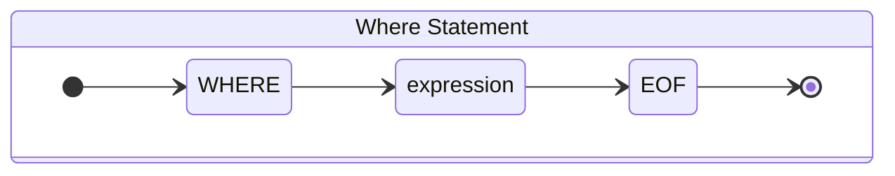
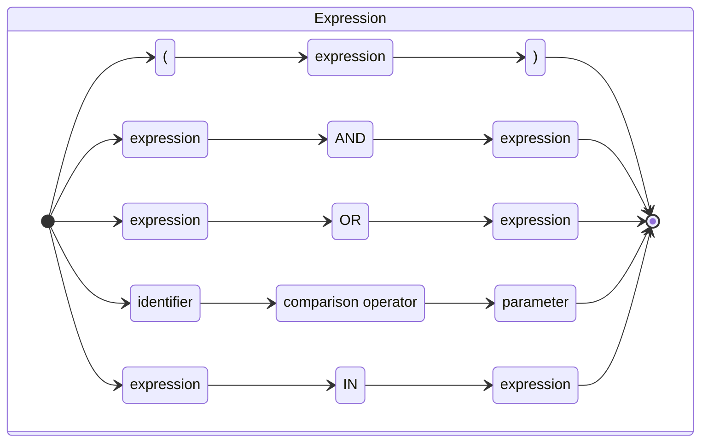
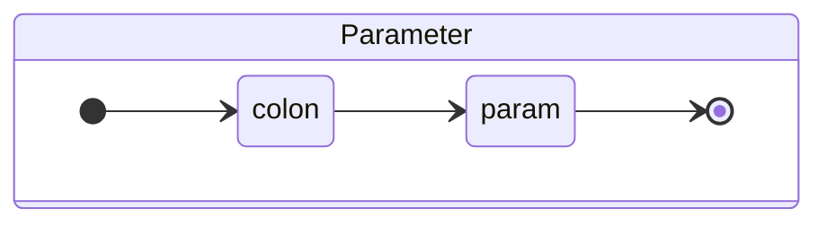

## Design Document: Bibernate ORM Architecture

### 1. Configuration: Overview

##### Purpose

The configuration module in Bibernate offers several key features to streamline the setup and management of application settings
and
resources.

- Entity Class Integration: Bibernate simplifies entity class integration by providing options to specify either packages or explicit entity
  classes that should be included in the metamodel. This approach ensures that only relevant entities are considered during metadata
  generation and configuration.

- Early Validation of Metamodel: The configuration process includes early validation of the metamodel, ensuring correctness and consistency
  in
  the definition of entities and their associations. This validation step helps identify any misconfigurations or missing annotations,
  leading
  to improved application stability and reliability.

- Flexible Configuration Formats: Bibernate supports various configuration formats, including YAML, properties, or XML files, offering
  flexibility to developers to choose their preferred format for defining application settings. This versatility simplifies configuration
  management and promotes consistency across different environments.

- Advanced DataSource Setup: The configuration module provides advanced setup options for configuring the datasource, allowing developers to
  specify database connection details, connection pooling parameters, and other datasource-related settings. This enables fine-tuning of
  datasource behavior for optimal performance and reliability.

- SessionFactory Creation: One of the primary functions of the configuration module is to facilitate the creation of the session factory. By
  abstracting away the complexities of session management and database interaction, Bibernate simplifies the process of creating and
  managing
  database sessions, ensuring efficient and reliable database operations.

In summary, the configuration module in Bibernate offers a comprehensive set of features to streamline the setup and management of
application settings and resources, including entity integration, early metamodel validation, flexible configuration formats, advanced
datasource setup, and session factory creation. These features collectively contribute to the ease of configuration and the robustness of
Bibernate-powered applications.

### 2. Metamodel: Overview

#### **Purpose**

The Metamodel serves as a central repository for storing metadata about Java entity classes and their mappings to database
tables and columns.

- **Elimination of Runtime Reflection**: By abstracting metadata retrieval logic, such as checking for annotations like @Column, it
  eliminates the need for runtime reflection.

- **Centralized Source for Table and Column Names**: The Metamodel functions as a centralized source for table and column names, which can
  be derived either manually or automatically converted with snake case from field names.

- **Reduced Coupling with Specific Implementation Details**: Encapsulating the Metamodel at a new abstract level significantly reduces
  coupling with specific implementation details, particularly annotations.

- **Simplified Development**: This abstraction simplifies development by abstracting away the complexities of metadata retrieval and
  providing a cleaner separation between different layers of the application. Moreover new features could be developed quickly e.g.
  lifecycles callbacks `@PrePersist`, `@PreUpdate`, `@PostPersist` etc

- **Additional Level of Early Validation**: Encapsulation facilitates an additional level of early validation. We validate that the entity
  is defined with @Id field, and ensure correctness of definition @OneToMany and @ManyToOne associations.

- **Ensuring Correctness of SQL Queries**: The Metamodel ensures the correctness of SQL queries by maintaining a predefined and consistent
  order of columns, contributing to database operation accuracy.

##### Core components:

- **Entity Mapping**: Represents the mapping between a Java entity class and its corresponding database table. Each Entity Mapping object
  encapsulates essential information such as the entity class, table name, and mappings to individual fields.

- **Field Mapping**: Complements Entity Mapping by representing the mapping between a Java entity field and its corresponding database
  column. Field Mapping encapsulates metadata properties such as column name, data type, and relationships, providing detailed information
  about individual fields within an entity.

- **Identity Strategy**: Abstracts the logic related to ID generation strategies for entities. It ensures consistency and accuracy in ID
  generation across the system, facilitating seamless integration and management of entity identifiers.

Supported Annotations for mapping:

- `@Entity`
- `@Table`
- `@Id`
- `@SequenceGeneratedValue`
- `@IdentityGeneratedValue`
- `@Column`
- `@OptimisticLock`
- `@Transient`
- `@JdbcType`
- `@ManyToOne`
- `@OneToMany`

### 3. Session:

#### 3.1 Main operation

The Session interface in Bibernate serves as the primary interface for interacting with the database within a transaction. It manages
entities (data objects) and provides methods to save, update, or delete them. Key points to note include:

Entities can be in different states: new (transient), managed (persistent), or disconnected (detached) from the Session.
Operations like persist, merge, and remove are used for managing entities within the Session.
Changes made to persistent entities are automatically synchronized with the database upon transaction commit.
Properly closing the Session is essential to release resources.
Sessions are not thread-safe, so each thread should have its own Session instance.
Objects obtained through getReference and find are consistent within a Session, ensuring data integrity.
Overall, the Session interface offers methods for common CRUD operations as well as custom queries.

#### 3.2 First level cache and proxy mechanism

The PersistenceContext class in Bibernate manages the first-level cache, which is crucial for improving performance by reducing the need for
repetitive database calls during a session.

**Purpose**: The PersistenceContext is responsible for storing entity and collection objects within a session, serving as the first-level
cache
in Hibernate.

Functionality:
**Managing Entities**: It provides methods to manage entities within the session, including retrieving, updating, removing, and checking
their
states.
**Managing Collections**: It allows the management of collections within the session, ensuring efficient handling and retrieval.
**Cache Invalidation**: It supports cache invalidation, ensuring that session-related entities and collections are properly unlinked and
cleared
when needed.

#### 3.3 Write behind cache (Action Queue)

ActionQueue is responsible for maintaining a queue of EntityActions.

- Priority-Based Execution: Actions are scheduled for execution based on their assigned priorities. Lower-priority actions are given
  precedence over higher-priority ones.
- Order Preservation: Actions sharing the same priority are executed in the order they were added to the queue. This ensures that actions
  maintain a consistent first-in-first-out (FIFO) order within their priority group.
  The purpose of the ActionQueue is to optimize the implementation of a write-behind cache. A write-behind cache is a caching mechanism that
  optimizes write operations by deferring them until necessary.

**Order of actions:**

- InsertAction/IdentityInsertAction
- UpdateAction
- DeleteAction

With write behind cache you can easily provide mechanism for batch operations.

Note: IdentityInsertAction executes immediately to provide generated by db entity key.

#### 3.4 Identity generator strategies

**Purpose**: Automatic Generation of Identity Values

The `@IdentityGeneratedValue` annotation is utilized to specify that the value of an annotated field will be automatically generated by an
identity column in the database. This annotation is typically applied to fields within entity classes to indicate that their values will be
managed by an identity column, alleviating the need for explicit value assignment.

Key Points:

Usage: Apply this annotation to fields in entity classes where automatic value generation via an identity column is desired.
Functionality: Indicates that the annotated field's value will be automatically managed by an identity column in the database.

###### Examples:

```java

@Entity
public class Product {

  @Id
  @IdentityGeneratedValue
  private Long id;

  private String name;

  // Constructors, getters, setters, etc.
}
```

##### 3.4.1 Manual

###### Example:

```java

import com.bibernate.hoverla.annotations.IdentityGeneratedValue;

@Entity
public class Product {

  @Id
  private Long id;

  @Column(name = "name")
  private String name;

  // Other attributes and methods
}
```

##### 3.4.1 Identity

###### Example:

```java

import com.bibernate.hoverla.annotations.IdentityGeneratedValue;

@Entity
@Table(name = "product")
public class Product {

  @Id
  @IdentityGeneratedValue
  private Long id;

  @Column(name = "name")
  private String name;

  // Other attributes and methods
}
```

##### 3.4.1 Sequence

The `@SequenceGeneratedValue` annotation enables the generation of unique sequence values from a PostgreSQL sequence within the context of a
session factory.

Thread-Safe Generation: Ensures thread safety during sequence value generation, preventing race conditions and ensuring reliable value
generation across multiple sessions/session factories.

Optimized Allocation: Allocates sequence values in chunks to minimize database round-trips and improve performance. The allocation size
should be configured to align with the database sequence's increment value, ensuring efficient utilization of sequence resources.

###### Example:

```java

@Entity
@Table(name = "product")
public class Product {

  @Id
  @SequenceGeneratedValue(sequenceName = "product_id_seq", allocationSize = 1)
  private Long id;

  @Column(name = "name")
  private String name;

  // Other attributes and methods
}
```

#### 3.5 JDBC interaction:

#### 3.5.1 JDBC types:

Purpose

The JdbcType annotation provides a flexible solution for handling JDBC types in Java entity classes. It allows developers to customize JDBC
type mappings for specific attributes, such as Postgres Enum types, and introduce custom converters by implementing BibernateJdbcType
implementations. This flexibility empowers developers to tailor JDBC mappings and converters to meet the specific requirements of their
application.

- **Custom JDBC Type Handling**: Certain types, like Postgres Enum types, require specific JDBC type handling. The JdbcType annotation
  allows developers to explicitly define the JDBC type mapping for such cases. For example, consider a Color enum mapped to a PostgreSQL
  Enum type:

###### Examples:

```java

@Entity
public class Product {

  @JdbcType(PostgreSqlJdbcEnumType.class)
  private Color color;
  // Other attributes and methods
}
```

- **Introduction of Converters**: In some cases, developers may need to introduce custom converters for certain attributes. The JdbcType
  annotation provides flexibility by allowing developers to implement custom BibernateJdbcType implementations. For instance, consider a
  Product entity with a price attribute that needs special formatting:

###### Example:

```java

@Entity
public class Product {

  @JdbcType(PriceJdbcType.class)
  private BigDecimal price;
  // Other attributes and methods
}
```

- **Implementation Flexibility**: Developers have the freedom to implement their own BibernateJdbcType implementations, as demonstrated by
  the PostgreSqlJdbcEnumType. This capability empowers developers to explicitly define JDBC mappings and/or converters for columns based on
  their specific requirements.

#### 3.6 Optimistic Lock

The Optimistic Lock Annotation facilitates optimistic concurrency control in database-driven applications:

Annotation: @OptimisticLock marks a field as the version counter for optimistic locking.
Concurrency Detection: The database increments the version counter on entity updates to detect concurrent modifications.
Concurrency Resolution: If versions match, updates proceed; if not, updates are rejected to prevent concurrent conflicts.

###### Examples:

```java

@Entity
public class Product {

  @OptimisticLock
  private int version;
  // Other attributes and methods
}
```

#### 3.7 Pessimistic Lock

Pessimistic Locking is a concurrency control mechanism that restricts access to a database resource to only one user or transaction at a
time. This locking strategy is applied when a user anticipates that another user might attempt to modify the same data concurrently, thereby
preventing potential conflicts and ensuring data consistency.

- FOR SHARE
- FOR UPDATE

#### 4. Query Language: Overview

**Purpose**

The Query Language provides a structured, object-oriented approach for formulating complex filtering conditions to retrieve specific data
from a dataset.

The Query Language grammar rules are defined using ANTLR, providing a robust framework for specifying the syntax and structure of queries.

Note:  the query language is case-sensitive.

- WHERE Clause: Indicates the beginning of the query and introduces filtering conditions.

- Logical Operators: Includes `AND` and `OR`, allowing users to combine multiple conditions logically.

- Comparison Predicates: Enables users to compare values using operators such as `<`, `>`, `<=`, `>=`, `=`, and `!=`.

- Parentheses: Allows users to group conditions to control the precedence of logical operations.

- IN Predicate: Provides a way to check if a value exists in a list of values.
    - If the collection parameter used in the "IN" condition is empty or null, the condition is ignored, and the result will not be filtered
      by the "IN" condition.
    - If the collection contains values, the "IN" condition is applied to match values in the specified column.

- Parameter Placeholder: Represented by a colon followed by an identifier, it acts as a placeholder for runtime values.

##### EBNF for the grammar:

EBNF (_Extended Backus-Naur Form_) is a notation used to describe the syntax of a language or grammar in a concise and
standardized format.

``` 
<where_statement> ::= "WHERE" <expression>

<expression> ::= <parameter_expression>
               | "(" <expression> ")"
               | <expression> "AND" <expression>
               | <expression> "OR" <expression>
               | <identifier> <comparison_operator> <parameter>
               | <identifier> "IN" <parameter>

<parameter_expression> ::= ":" <identifier>

<comparison_operator> ::= "<" | ">" | "<=" | ">=" | "=" | "!="

<identifier> ::= [a-zA-Z]+

<parameter> ::= ":" <identifier>
```

Please see visual representation:







###### Examples:

```java

List<MyEntity> result = session.createQuery("WHERE age > :ageParam AND name = :nameParam", MyEntity.class)
  .setParameter("ageParam", 30)
  .setParameter("nameParam", "John")
  .getResult();
```

```java
List<MyEntity> result = session.createQuery("WHERE id IN :ids", MyEntity.class)
  .setParameter("ids", List.of(1L, 2L, 3L))
  .getResult();
```

