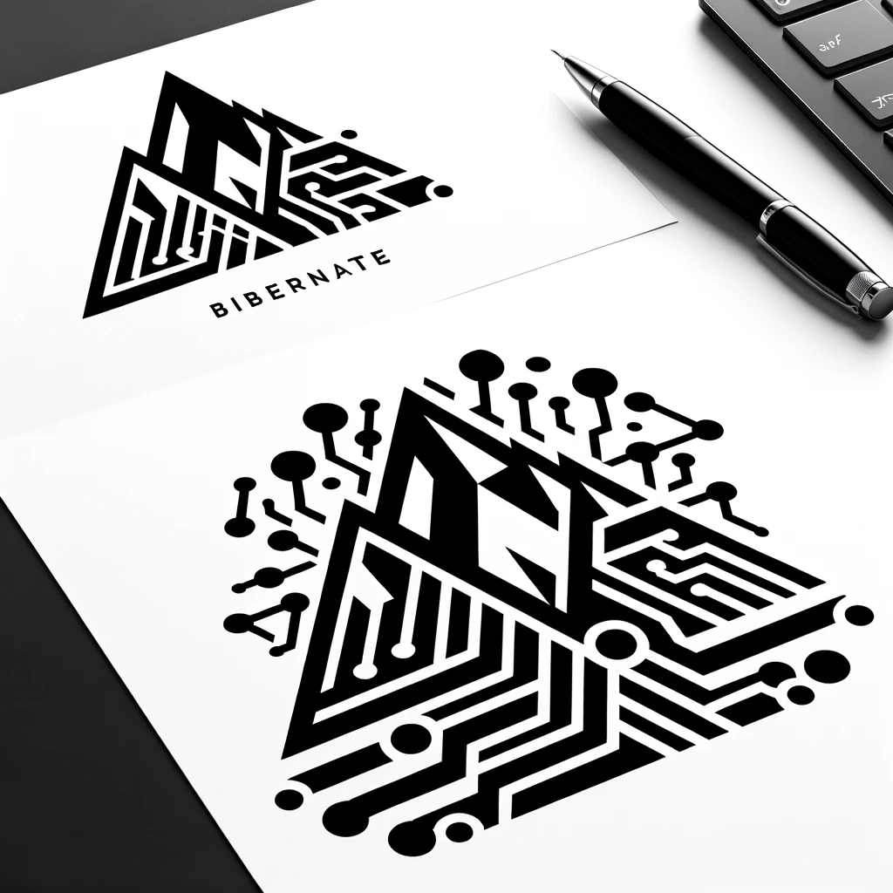

# Hoverla Bibernate

Bibernate is an advanced ORM (Object-Relational Mapping) framework designed to facilitate seamless data interaction between Java applications and relational databases. This document provides detailed guidance on configuring Bibernate, a lightweight and high-performance JDBC connection pool.



## Getting Started

Follow these steps to get started with our project:

1. **Clone the Repository:**

    ```
     git clone https://github.com/hoverla-team-2023/hoverla-bibernate.git
     cd hoverla-bibernate
    ```

2. **Build the Project:**

    ```
    mvn clean install -Dmaven.test.skip=true
    
    mvn install:install-file \
    -Dfile=target/hoverla-bibernate-1.0-SNAPSHOT.jar \
    -DgroupId=com.bibernate.hoverla \
    -DartifactId=hoverla-bibernate \
    -Dversion=1.0-SNAPSHOT \
    -Dpackaging=jar
    ```

3. **Add the Project as a dependency:**

    ```java
    <dependency>
        <groupId>com.bibernate.hoverla</groupId>
        <artifactId>hoverla-bibernate</artifactId>
        <version>${bibernate.version}</version>
     </dependency>
    ```

4. **Add config:**

    ```java
    bibernate:
      connection-pool:
        type: hikari
      dataSourceClassName: com.zaxxer.hikari.HikariDataSource
      dataSource:
        jdbcUrl: jdbc:postgresql://host:5432/{your_database}
        username: {your_username}
        password: {your_password}
    ```

5. **Setting up PostgreSQL with Docker Compose**

    ```java
    version: '3.8'
    
    services:
      postgres:
        image: postgres
        restart: always
        environment:
          POSTGRES_DB: {your_database}
          POSTGRES_USER: {your_username}
          POSTGRES_PASSWORD: {your_password}
        ports:
          - "5432:5432"
    ```
## Configuration

Bibernate leverages connection pool for its datasource management, ensuring optimal database performance and resource utilization. Below is the recommended configuration setup for integrating HikariCP with Bibernate:

```yaml
bibernate:
  connection-pool:
    type: hikari
  dataSourceClassName: com.zaxxer.hikari.HikariDataSource
  dataSource:
    jdbcUrl: jdbc:postgresql://host:5432/db
    username: user
    password: pass
    minimumIdle: 5
    idleTimeout: 600000
    maximumPoolSize: 15
    autoCommit: true
    poolName: HikariCorePool
    maxLifetime: 1800000
    connectionTimeout: 30000
```

## Example Usage

```java
public class AppDemo {
  public static void main(String[] args) {
    // Create the SessionFactory
    SessionFactory sessionFactory = new Configuration()
      .configure("config.yml")
      .buildSessionFactory();

    // Create session
    Session session = sessionFactory.openSession();
    session.beginTransaction();

    // Perform database operations
    // Example: Retrieve all objects of a specific entity
    List<Object> resultList = session.createQuery("FROM YourEntity")
      .getResultList();

    for (Object obj : resultList) {
      // Process retrieved objects
      System.out.println(obj);
    }

    // Commit transaction and close session
    session.getTransaction().commit();
    session.close();

    // Close the SessionFactory
    sessionFactory.close();
  }
}
```


Features:

- **Metamodel**:  Stands as the ultimate solution for Java entity classes`@Entity`, eliminating the need for runtime reflection while providing a centralized repository for metadata, including mappings and strategies.
- **Early Validation**: Empowerment Through Metamodel The Metamodel feature offers early validation capabilities for Java entity classes, providing developers with a streamlined approach to ensuring correctness and accuracy from the outset of the development process.
- **Fine-tuned Field Configuration**: Tailor field behavior in database interactions with attributes like insertable, updatable, and transient, offering granular control over column properties.
- **Support for `*.yml`, `*.properties`, `*.xml`** configuration files: Compatibility with various configuration file formats for easier setup.
- **Hikari Connection Pool Advanced Configuration**: Harness the full potential of the Hikari DataSource by fine-tuning advanced options for optimal performance.
- **Manual Id Assignment**: Ability to manually assign identifiers to entities.
- **Sequence Generator**: Automate identifier generation by utilizing database sequences, ensuring efficient and reliable entity identification.
- **Identity Generator**: Automatic generation of unique identifiers for entities.
- **CRUD Operations**: Basic Create, Read, Update, and Delete operations for entities.
- **Dirty Check**: Perform dirty checking to determine if entity fields have been modified before updating the database, ensuring only relevant changes are persisted.- 
- **Transaction Management**: Support for managing transactions, including begin, commit, and rollback.
- **Dynamic Update**: Support dynamic updating of entities, where only modified fields are included in update statements.
- **Write Behind Cache**: Caching mechanism that writes data to the database asynchronously.
- **First Level Cache**: Cache mechanism for storing recently accessed entities in memory.
- **Lazy Loading with Proxy for `@ManyToOne` Relationships**: Lazy loading of one-to-many relationships using proxy objects.
- **Optimistic Locking**: Entities can be marked with an optimistic lock, typically represented by a version counter field, to manage concurrent updates. This mechanism allows the database to detect conflicts when multiple users try to modify the same entity simultaneously.
- **Pessimistic Locking**: Concurrency control mechanism to lock entities to prevent other transactions from accessing them.
- **Lazy Loading for Collections `@OneToMany`**: Loading of collection attributes only when accessed, for performance optimization.
- **Advanced Custom JDBC Types**: Support for custom JDBC types for more complex data mapping scenarios e.g. `@JdbcType(PostgreSqlJdbcEnumType.class)`
- **BQL (Bibernate Query Language)**: BQL simplifies query construction by providing a robust grammar-based query language, enhancing the querying experience.
